# 📊 Диаграммы активностей — BSUIR Helper

## Содержание
1. [Просмотр списка преподавателей](#1)
2. [Добавление отзыва](#2)
3. [Редактирование информации о преподавателе](#3)

---

### 1. Просмотр списка преподавателей

---

### 2. Добавление отзыва

---

### 3. Редактирование информации о преподавателе

