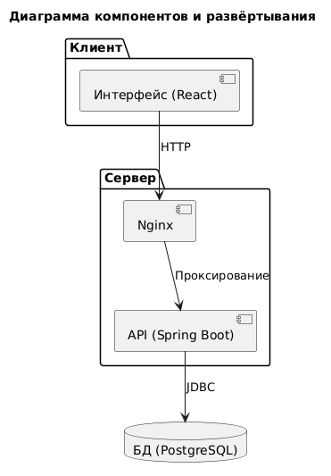
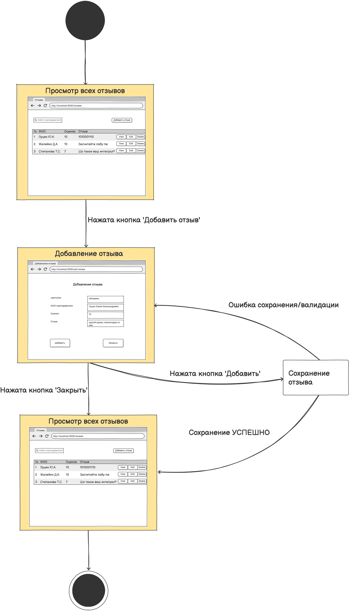
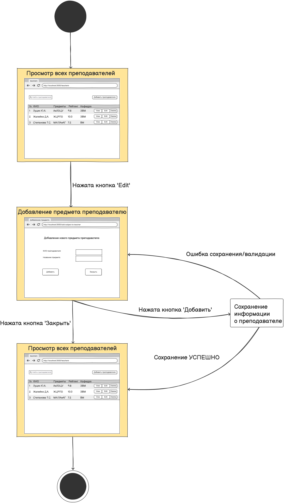
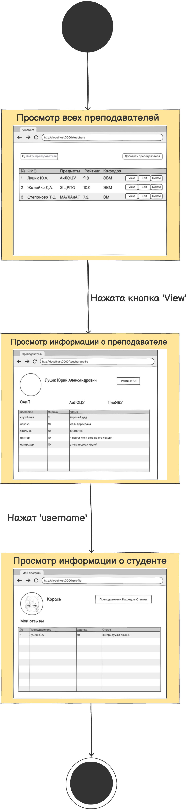

# Содержание
1. [Activity](#activity)
1. [Class](#class)
1. [Component](#component)
1. [Sequence](#sequence)
1. [State](#state)
1. [Use case](#use-case)

---

## Activity

# 📊 Диаграммы активностей — BSUIR Helper

## Содержание
1. [Просмотр списка преподавателей](#1)
2. [Добавление отзыва](#2)
3. [Редактирование информации о преподавателе](#3)

---

### 1. Просмотр списка преподавателей

---

### 2. Добавление отзыва

---

### 3. Редактирование информации о преподавателе

## Class

# Диаграмма классов

## Глоссарий

| Понятие      | Описание                                                                 |
|--------------|--------------------------------------------------------------------------|
| **Teacher**  | Класс для преподавателя: атрибуты - ID, ФИО, ID кафедры; методы - добавление предмета, расчет рейтинга; коллекции - список предметов, список отзывов. |
| **Department**| Класс для кафедры: атрибуты - ID, название, средний рейтинг; методы - добавление преподавателя, поиск лучшего; коллекция - список преподавателей. |
| **Subject**  | Класс для предмета: атрибуты - ID, название, ID преподавателя; методы - назначение преподавателю. |
| **Review**   | Класс для отзыва: атрибуты - ID, текст, рейтинг, ID преподавателя; методы - установка рейтинга, отправка. |

## Component

# Диаграмма компонентов и развёртывания

## Sequence

# Диаграммы последовательностей

## Содержание
1. [Просмотр профиля преподавателя](#1)
2. [Добавление отзыва](#2)
3. [Поиск преподавателей](#3)
4. [Добавление предмета](#4)

### 1. Просмотр профиля преподавателя

### 2. Добавление отзыва

### 3. Поиск преподавателей

## State

# Диаграмма состояний

# Содержание
1. [Добавление отзыва](#1)
2. [Добавление предмета преподавателю](#2)
3. [Просмотр информации о студенте](#3)

### 1. Добавление отзыва

### 2. Добавление предмета преподавателю

### 3. Просмотр информации о студенте

## Use case

# 📘 Диаграмма вариантов использования — BSUIR Helper

## Назначение документа

## 📚 Глоссарий

| Термин          | Определение                                                                 |
|-----------------|-----------------------------------------------------------------------------|
| **Студент**     | Пользователь, просматривающий информацию и добавляющий отзывы.              |
| **Преподаватель**| Сущность с атрибутами: ФИО, кафедра, предметы, рейтинг.                     |
| **Отзыв**       | Сущность с текстом и оценкой (1-5).                                         |
| **Кафедра**     | Сущность с преподавателями и средним рейтингом.                             |

## 🎭 1. Актёры

| Актёр          | Описание                                          |
|----------------|---------------------------------------------------|
| **Студент**    | Пользователь, оставляет отзывы и ищет информацию. |

## 🎬 2. Варианты использования

### 2.1 Просмотреть список преподавателей

**Описание:** Отображение таблицы преподавателей (FR-01).  
**Предусловия:** Авторизация.  
**Основной поток:** Открытие страницы → Загрузка списка → Отображение таблицы.  
**Альтернативный поток:** Пустой список → Сообщение "Нет данных".

### 2.2 Поиск преподавателей

**Описание:** Фильтрация по ФИО (FR-02).  
**Основной поток:** Ввод запроса → API-запрос → Отображение результатов.

### 2.3 Просмотреть профиль преподавателя

**Описание:** Детали с отзывами (FR-05).  
**Основной поток:** Выбор → Загрузка данных → Отображение карточки и таблицы отзывов.

### 2.4 Добавить отзыв

**Описание:** Создание отзыва (FR-03).  
**Основной поток:** Открытие формы → Ввод текста/оценки → Сохранение → Обновление рейтинга.  
**Альтернативный поток:** Валидация → Ошибка → Повтор ввода.

### 2.5 Добавить преподавателя

**Описание:** Админ-функция (FR-04).  
**Основной поток:** Форма → Сохранение в БД → Обновление списка.

### 2.6 Редактировать преподавателя

**Описание:** Обновление данных (FR-04).  
**Основной поток:** Выбор → Редактирование → Сохранение.

### 2.7 Удалить преподавателя

**Описание:** Удаление (FR-04).  
**Основной поток:** Подтверждение → Удаление → Обновление.

### 2.8 Добавить предмет

**Описание:** Привязка предмета (FR-07).  
**Основной поток:** Форма → Создание → Обновление профиля.

### 2.9 Просмотреть кафедры

**Описание:** Список с рейтингом (FR-06).  
**Основной поток:** Загрузка → Отображение с лучшим преподавателем.

