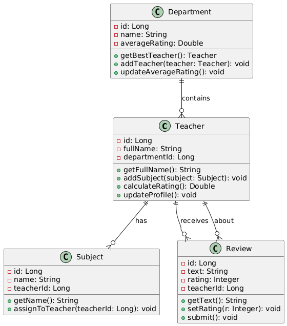

# Диаграмма классов

## Глоссарий

| Понятие      | Описание                                                                 |
|--------------|--------------------------------------------------------------------------|
| **Teacher**  | Класс для преподавателя: атрибуты - ID, ФИО, ID кафедры; методы - добавление предмета, расчет рейтинга; коллекции - список предметов, список отзывов. |
| **Department**| Класс для кафедры: атрибуты - ID, название, средний рейтинг; методы - добавление преподавателя, поиск лучшего; коллекция - список преподавателей. |
| **Subject**  | Класс для предмета: атрибуты - ID, название, ID преподавателя; методы - назначение преподавателю. |
| **Review**   | Класс для отзыва: атрибуты - ID, текст, рейтинг, ID преподавателя; методы - установка рейтинга, отправка. |
