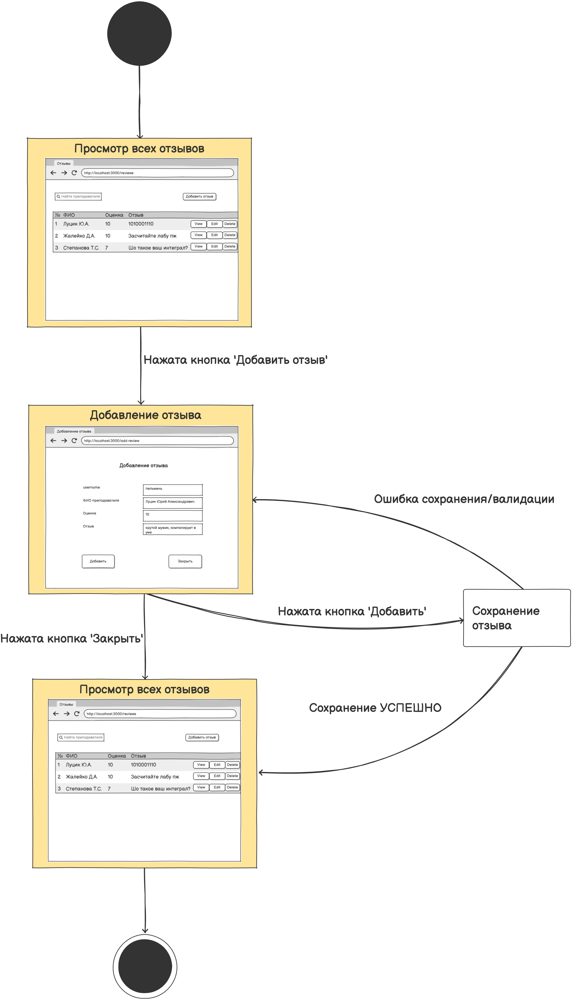
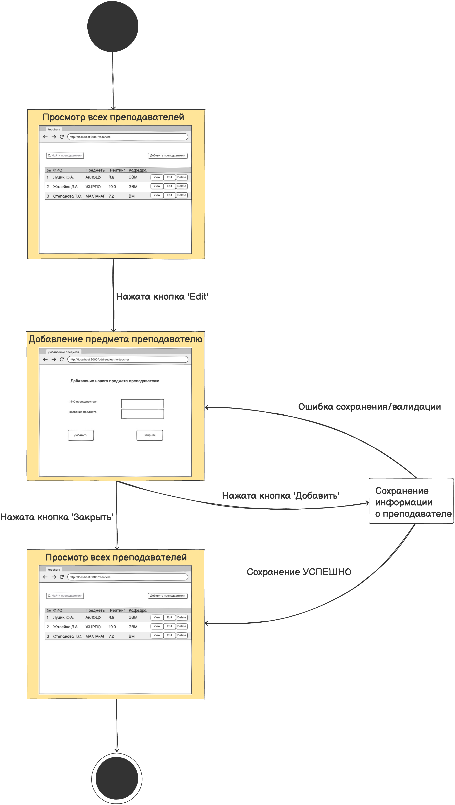
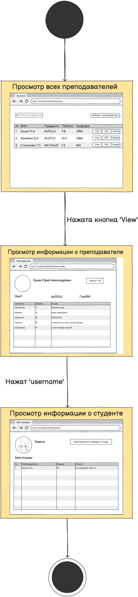

# Диаграмма состояний

# Содержание
1. [Добавление отзыва](#1)
2. [Добавление предмета преподавателю](#2)
3. [Просмотр информации о студенте](#3)

### 1. Добавление отзыва

### 2. Добавление предмета преподавателю

### 3. Просмотр информации о студенте

